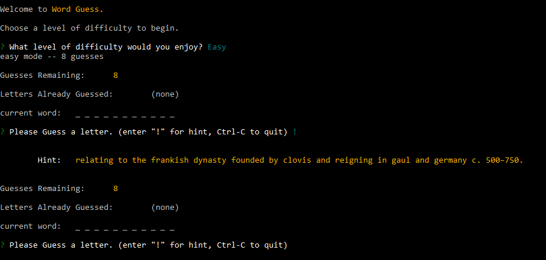
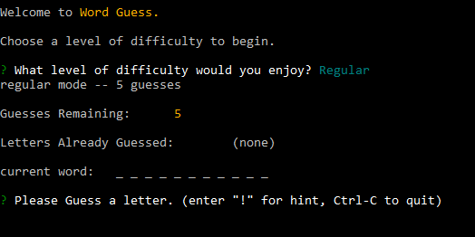
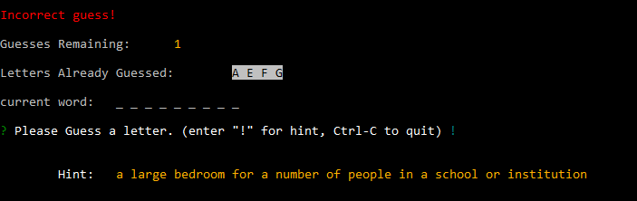

# Node-Word-Guess
This is the popular word guessing game "Hangman." This application is written in node.js.

To install it, please clone the repository and then run `npm install` to install the node module dependencies.

To run the application, in terminal or your favorite command line environment, change to the directory where the application is installed and invoke `node index.js` from the command line.

The game allows you to choose a difficulty level when attempting to guess a word. "Easy" corresponds to eight allowed guess attempts before the game is lost. Likewise, "Regular" allows up to five incorrect guesses before the user fails the challenge, whereas "Difficult" only provides three chances to guess wrongly.

Once the user chooses a difficulty level, a word is randomly selected from the wordList object in the wordlist.js file and the user is allowed to enter letters to try against the word. Before letters are correctly guessed, the letters are displayed masked.

The game is won if the user completes the hidden word before exhausting the remaining chances to guess. But if the user exhausts all chances to guess before completely revealing the hidden word, the game is lost.

At the end of every game, regardless of whether the user won or lost, the user will be asked to play again.

A nice feature is the ability to see a hint for the word the user is attempting to guess. To see the hint, just enter an exclamation point instead of a letter, and the hint will be displayed.

Another noteworthy feature is the ability for the user to customize the list of words and hints which the application uses. The file wordlist.js contains an object with two arrays of strings, wordsArray and hintsArray. The user can change the list if desired. However, it is important to recognize that each hint in the hintsArray corresponds to a word in the wordsArray at the same index, and vice versa. Therefore the arrays must be equal in length or else an error will result.

